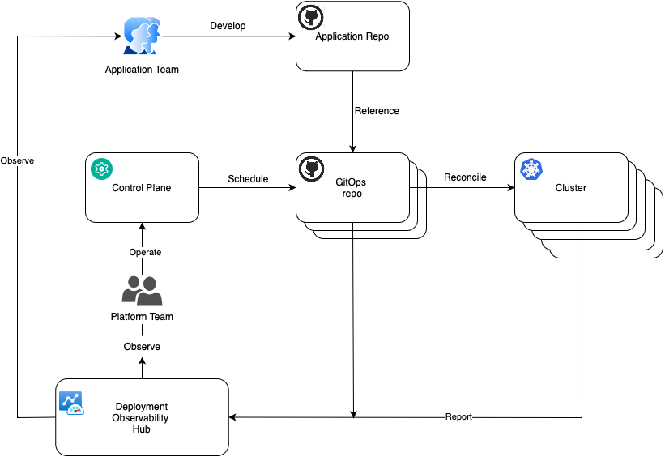
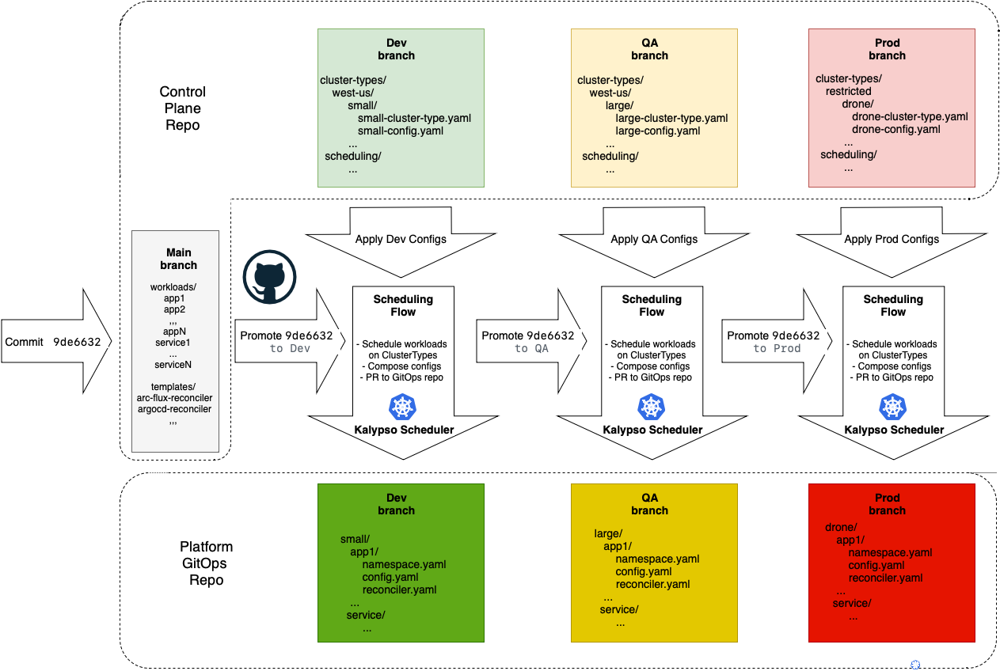

# Introduction

Kalypso provides a composable reference architecture of the workload management in a multi-cluster and multi-tenant environment with GitOps.

This is an umbrella repository that contains requirements, use cases, high level architecture and design decisions. The overall solution is composable so that every single component is handled in [its own repository](#referenced-repositories).

## Motivation

There is an organization developing cloud-native applications. Any application needs a compute to work on. For cloud native a compute is a K8s cluster. An organization may have a single cluster or, which is more common, there are multiple clusters. So they have to decide what applications should work on what clusters, or in other words, schedule them. The result of this decision or scheduling is a model of their cluster fleet, the desired state of the world if you will. Having that in place, they need somehow to deliver applications to the assigned clusters so they will turn the desired state into the reality or in other words reconcile it.

Every single application goes through a certain software development lifecycle, that promotes it to the production environment. E.g. an application is built, deployed to Dev environment, tested and promoted to Stage environment, tested and finally delivered to production. So the application requires and targets different K8s resources to support its SDLC. Furthermore, the applications normally expect on the clusters some platform services like Prometheus and Fluentbit and infra configurations like networking policy.

Depending on the application, the variety of the cluster types where the application is deployed in its lifecycle may be very diverse. The very same application with different configurations may be hosted on a managed cluster in the cloud, a connected cluster on prem, a fleet of clusters on semi-connected edge devices on factory lines or military drones, an air-gapped cluster on a starship. Besides that, clusters involved in the early lifecycle stages such as Dev and QA are normally managed by the developer, but the actual production clusters and reconciling to them may be managed by the organization's customers. In the latter case the developer may be only responsible for promoting and scheduling the application across different rings.  

The scenarios described above can be handled manually with a handful of scripts and pipelines in a small organization operating a single application and a few clusters. In enterprise organizations this is a real challenge. They operate at scale, producing hundreds of applications targeting hundreds of cluster types that are backed up by thousands of physical clusters. It would be fair to say, that handling that manually with scripts is simply not feasible. It requires a scalable automated solution with the following capabilities:

- Separation of concerns on scheduling and reconciling
- Promotion of the fleet state through a chain of environments
- Sophisticated, extensible and replaceable scheduler
- Flexibility to use different reconcilers for different cluster types depending in their nature and connectivity

### Existing projects

It's worth mentioning that there is a variety of existing projects targeting to address some of the described challenges. Most of them are built on the *Hub/Spoke* concept where there is a *Hub* cluster that controls workload placement across connected *Spoke* clusters. Examples of such tools are [Kubefed](https://github.com/kubernetes-sigs/kubefed), [Karmada](https://karmada.io/), [KubeVela](https://kubevela.io/), [OCM](https://open-cluster-management.io/), [Azure Kubernetes Fleet](https://learn.microsoft.com/en-us/azure/kubernetes-fleet/overview), [Rancher Fleet](https://fleet.rancher.io) etc. By definition, solutions like that expect a connection between *Hub* and *Spoke* clusters, at least an occasional one. They commonly provide a monolithic functionality, meaning they implement both workload scheduling and reconciling to the spoke clusters, so that scheduling and reconciling are tightly coupled to each other.

Historically, most of such tools have been designed to federate applications across multiple clusters. They are supposed to provide scalability, availability and security capabilities for a single application instance by breaking through Kubernetes limit of 5k nodes and placing an application across multiple regions and security zones. A solution like that is a perfect fit for a group or a fleet of connected clusters of the same or similar type with simple workload placement, based on labels and cluster performance metrics. From the perspective of this project, a cluster fleet like that is considered as a single deployment target, as a cluster of clusters with its own mechanics to load and balance the underlying compute.

## Roles

### Platform Team

Platform team takes care of the cluster fleet that hosts applications produced by app teams.

*Key responsibilities*:

- Define staging environments (Dev, QA, UAT, Prod)
- Define cluster types in the fleet (group of clusters sharing the same configurations) and their distribution across environments
- Provision New clusters (CAPI/Crossplane/Bicep/Terraform/…)
- Manage infrastructure configurations and platform services (e.g. RBAC, Istio, Service Accounts, Prometheus, Flux, etc.) across cluster types
- Schedule applications on cluster types

### Application Team

Application team is responsible for their core application logic and providing the Kubernetes manifests that define how to deploy that application and its dependencies. They are responsible for owning their CI pipeline that creates container images, Kubernetes manifests and any validation steps required prior to rollout (e.g., testing, linting). The application team may have limited knowledge of the clusters that they are deploying to, and primarily need to understand the success of their application rollout as defined by the success of the pipeline stages. The application team is not aware of the structure of the entire fleet, global configurations and what other teams do.

*Key responsibilities*:

- Run full SDLC of their applications: develop, build, deploy, test, promote, release, support, bugfix, etc.
- Maintain and contribute to source and manifests repositories of their applications
- Define and configure application deployment targets
- Communicate to Platform Team requesting desired infrastructure for successful SDLC

### Application Operators

Application Operators work with the applications on the clusters on the edge. They are normally in charge of application instances working on a single or a small group of clusters. They may perform some local configurations for the specific clusters and applications instances. This role is out of scope of this project.

## High Level Flow

The diagram above describes interaction between the roles and the major components of the solution. The primary concept of the whole process is separation of concerns. There are workloads, such as applications and platform services, and there is a platform where these workloads are working on. Application team takes care of the workloads (*what*), while the platform team is focused on the platform (*where*).

Application Team runs SDLC of their applications and promotes changes across environments. Application Team doesn't operate with the notion of the cluster. They have no idea on which clusters their application will be deployed in each environments. Application Team operates with the concept of *Deployment Target*, which is just an abstraction within an environment. Examples of deployment targets could be: *Integration* on Dev, *functional tests* and *performance tests* on QA, *early adopters* and *external users* on Prod and so on. Application Team defines deployment targets for each environment and they know how to configure their application and how to generate manifests for each deployment target. This process is owned by Application Team, it is automated and exists in the application repositories space. The outcome of the Application Team is generated manifests for each deployment target, stored in a git repository.

Platform team has a very limited knowledge about the applications and therefore is not involved in the application configuration and deployment process. Platform team is in charge of platform clusters, that are grouped in *Cluster Types*. They describe *Cluster Types* with configuration values, such as DNS names, endpoints of external services and so on. Platform team assigns (*schedules*) application deployment targets to various cluster types. With that in place, the application behavior will be determined by the combination of *Deployment Target* configuration values, provided by Application Team, and *Cluster Type* configuration values, provided by the Platform Team.  

Platform Team defines and configures *Cluster Types* and assigns *Deployment Targets* in the *Control Plane*. This is the place where they model their Platform. It's like a source repository for the Application Team. It's important to say, that the platform team doesn't manually schedule *Deployment Targets* on *Cluster Types* one by one. Instead of that they define scheduling rules in the *Control Plane*. Those rules along with configuration values are processed by an automated process that saves the result to the *Platform GitOps repo*. This repository contains folders for each *Cluster Type* with the information on what workloads should work on it and what configuration values should be applied. Clusters can grab that information from the corresponding folder with their preferred reconciler and apply the manifests.

Clusters report their compliance state with GitOps repositories to the *Deployment Observability Hub*. Platform and Application teams query this information to analyze workload deployment across the clusters historically. It can be used in the dashboards, alerts and in the deployment pipelines to implement progressive rollout.

## Primary Use Cases

- [Platform team onboards a workload](./docs/use-cases/platform-team-onboards-workload.md)
- [Platform team defines a cluster type](./docs/images/under-construction.png)
- [Platform team provides a configuration value for a cluster type](./docs/images/under-construction.png)
- [Platform team schedules an application on cluster types](./docs/images/under-construction.png)
- [Application team defines application deployment targets](./docs/images/under-construction.png)
- [Application team provides a configuration value for a deployment target](./docs/images/under-construction.png)
- [Application team updates the application](./docs/images/under-construction.png)
- [Platform team defines service deployment targets](./docs/images/under-construction.png)
- [Platform team provides a configuration value for a service deployment target](./docs/images/under-construction.png)
- [Platform team updates a platform service](./docs/images/under-construction.png)

## Design Details

### Control Plane

Platform Team models the fleet in the *Control Plane*. It's supposed to be human oriented, easy to understand, update, and review. Even though the entire fleet may consist of 100k clusters, the *Control Plane* doesn't contain that detailed information. It operates with the abstractions of *Cluster Types*, *Workloads*, *Scheduling Policy*, *Configs*, *Templates* and so on. See full list of abstractions in [Kalypso Control Plane](https://github.com/microsoft/kalypso-control-plane) repository.

There are various visions of how the *Control Plane* may be implemented. Following the GitOps concepts it can be a Git repo, following the *classic* architecture it might me a database service with some API exposed.

The main requirement to the *Control Plane* in this design is to provide a reliable and safe change/transaction processing functionality (OLTP). It's not supposed to be queried with a complex queries against a large amount of data (OLAP).

With that said, in this project the *Control Plane* is implemented on top of a Git repository. It gives:

- all the benefits of GitOps
- "out-of-the-box" tracking, PR/Review functionality, provided by Git repositories such as GitHub
- easy promotional flow implementation with GH Actions
- no need to maintain and expose a separate *Control Plane* service  

Overall, the *Kalypso Control Plane* consists of the following components:

- GitHub repository along with a set of GH Actions workflows
- Cli tool to provision repositories and manipulate control plane abstractions
- K8s cluster running *Kalypso Scheduler*  

### Promotion and Scheduling

The *Control Plane* repository contains two types of data:

- The data that is about to be promoted across environments such as a list of onboarded workloads and various templates.
- Environment specific configurations such as included into environment *Cluster Types*, config values and secrets, scheduling policies. This data is not promoted as it is specific for each environment.

The data to be promoted lives in *main* branch while environment specific data is stored in the corresponding environment branches (e.g. dev, qa, prod). Transforming data from the *Control Plane* to the *GitOps repo* is a combination of the promotion and scheduling flows. The promotion flow moves the change across the environments horizontally and the scheduling flow does the scheduling and generates manifests vertically for each environment.

A commit to the *main* branch starts the promotion flow that triggers the scheduling/transforming flow for each environment one by one. The scheduling/transforming flow takes the base manifests from *main*, applies configs from a corresponding to this environment branch (Dev, QA,..Prod) and PRs the resulting manifests to the *Platform GitOps repo* in the corresponding to the environment branch. Once the rollout on this environment is complete and successful, the promotion flow goes ahead and performs the same procedure on the next environment. On every environment the flow promotes the same commitid of the main branch, making sure that the content from *main* is getting to the next environment only after success on the previous environment.

A commit to the environment branch (Dev, Qa, …Prod) in the *Control repo* will just start the scheduling/transforming flow for this environment. E.g. we have changed cosmo-db endpoint for QA, we just need to make updates to the QA branch of the GitOps repo, we don’t want to touch anything else. The scheduling will take the *main* content corresponding to the latest commitid promoted to this environment, apply configurations and PR the resulting manifests to the GitOps branch.

The scheduling/transformation flow is a K8s operator [Kalypso Scheduler](https://github.com/microsoft/kalypso-scheduler) hosted on a *Control Plane* K8s cluster. It watches changes in the *Control Plane* environment branches, performs necessary scheduling, transformations, generates manifests and PR's them to the *Platform  GitOps repository*.

There are a few bullets to highlight here:

- The promotion flow doesn’t generate anything. It’s just a vehicle to orchestrate the flow. It provides approvals, gates, state tracking. Performs post and pre-deployment activities.
- The *Kalypso Scheduler* pulls the changes from the control plane repo with Flux. It knows exactly what has changed, and regenerates only related manifests. It doesn't rebuild the entire fleet.
- It gives advantages of both worlds - GH Actions and K8s:
  - Powerful promotion flow orchestrator
  - Precise event driven scheduling and transformation. We don’t reboil the ocean while reacting on a change in the *Control Plane*. There is neither a bottleneck, nor a butterfly effect.

### Workload Namespace

In the *Platform GitOps repo* each workload assignment to a *ClusterType* is represented by a folder containing:

- A dedicated namespace for this workload on a cluster of this type
- Platform policies restricting workload permissions
- Consolidated platform config maps and secrets that the workload can use
- Reconciler resources pointing to a *Workload GitOps repo* where the actual workload manifests live. E.g. Flux GitRepository and Flux Kustomization, ArgoCD Application, Zarf descriptors, etc.

### Dial-tone services

Dial-tone services are workloads and therefore they live in their own source/GitOps git repository pairs, just like applications. It gives:

- Clean separation of “what is running” (apps and services) from “where it is running” (platform). These two things have completely different lifecycles.
- Clean orchestration and simple scheduler for the control plane. There is no workload manifest generation at all, only promotion, scheduling and configs.
- Their maybe multiple control planes that can consume same dial tone services  

### Cluster types and Reconcilers

Every single cluster type can use a different reconciler to deliver manifests from the *GitOps repos*. Reconciler examples are Flux, ArgoCD, Zarf, Rancher Fleet, etc. *Cluster Type* definition refers to a *reconciler*, which is merely a named collection of manifest templates. The scheduler uses these templates to produce reconciler resources such as Flux GitRepository and Flux Kustomization, ArgoCD Application, Zarf descriptors, etc. The very same workload may be scheduled to the *Cluster Types* managed by different reconcilers, for example Flux and ArgoCD. The scheduler will generate Flux GitRepository and Flux Kustomization for one cluster and ArgoCD Application for another cluster, but both of them will point to the same *Workload GitOps repository* containing the workload manifests.

### Extensible Scheduler

Kalypso scheduler operates with the [Control Plane abstractions](https://github.com/microsoft/kalypso-control-plane), understands *Control Plane* and *Platform GitOps* repo structures and implements primitive label based scheduling logic. It delegates everything beyond to an external scheduler. Out-of-the-box it comes with an adaptor to the [Open Cluster Management Placement](https://open-cluster-management.io/concepts/placement/#placementdecisions) which implements all the heavy lifting scheduling and can be [extended with the custom logic](https://open-cluster-management.io/scenarios/extend-multicluster-scheduling-capabilities/). See the details in the [Kalypso Scheduler](https://github.com/microsoft/kalypso-scheduler) repo.

### Deployment Observability Hub

Deployment Observability Hub is implemented as a central storage which is easy to query with complex queries against a large amount of data. It contains deployment data with the historical information on the workload versions and their deployment state across clusters in the fleet. Clusters register themselves in the storage and update their compliance status with an agent (e.g. Arc Flux Configuration agent). Clusters operate at the level of GitOps commits only. High level information, such as application versions, environments, cluster types is transferred to the central storage from the *GitOps repos*. In the central storage the high level information gets correlated with the commit compliance data coming from the clusters. See the details in the [Kalypso Observability Hub](./docs/images/under-construction.png) repo.

## Referenced Repositories

|Repository|Description|
|--------|----------|
|[Application Source](https://github.com/microsoft/kalypso-app-src)|Contains a sample application source code including Docker files, manifest templates and CI/CD workflows|
|[Application GitOps](https://github.com/microsoft/kalypso-app-gitops)|Contains final sample application manifests to be deployed to the deployment targets|
|[Services Source](https://github.com/microsoft/kalypso-svc-src)|Contains high level manifest templates of sample dial-tone platform services and CI/CD workflows|
|[Services GitOps](https://github.com/microsoft/kalypso-svc-gitops)|Contains final manifests of sample dial-tone platform services to be deployed across clusters fleet|
|[Control Plane](https://github.com/microsoft/kalypso-control-plane)|Contains a platform model including environments, cluster types, applications and services, mapping rules and configurations, Promotion Flow workflows|
|[Platform GitOps](https://github.com/microsoft/kalypso-gitops)|Contains final manifests representing the topology of the fleet - what cluster types are available, how they are distributed across environments and what is supposed to deployed where|
|[Kalypso Scheduler](https://github.com/microsoft/kalypso-scheduler)|Contains detailed design and source code of the scheduler operator, responsible for scheduling applications and services on cluster types and uploading the result to the GitOps repo|
|[Kalypso Observability Hub](./docs/images/under-construction.png)|Contains detailed design and source code of the deployment observability service|

## Contributing

This project welcomes contributions and suggestions.  Most contributions require you to agree to a
Contributor License Agreement (CLA) declaring that you have the right to, and actually do, grant us
the rights to use your contribution. For details, visit <https://cla.opensource.microsoft.com>.

When you submit a pull request, a CLA bot will automatically determine whether you need to provide
a CLA and decorate the PR appropriately (e.g., status check, comment). Simply follow the instructions
provided by the bot. You will only need to do this once across all repos using our CLA.

This project has adopted the [Microsoft Open Source Code of Conduct](https://opensource.microsoft.com/codeofconduct/).
For more information see the [Code of Conduct FAQ](https://opensource.microsoft.com/codeofconduct/faq/) or
contact [opencode@microsoft.com](mailto:opencode@microsoft.com) with any additional questions or comments.

## Trademarks

This project may contain trademarks or logos for projects, products, or services. Authorized use of Microsoft
trademarks or logos is subject to and must follow
[Microsoft's Trademark & Brand Guidelines](https://www.microsoft.com/en-us/legal/intellectualproperty/trademarks/usage/general).
Use of Microsoft trademarks or logos in modified versions of this project must not cause confusion or imply Microsoft sponsorship.
Any use of third-party trademarks or logos are subject to those third-party's policies.
