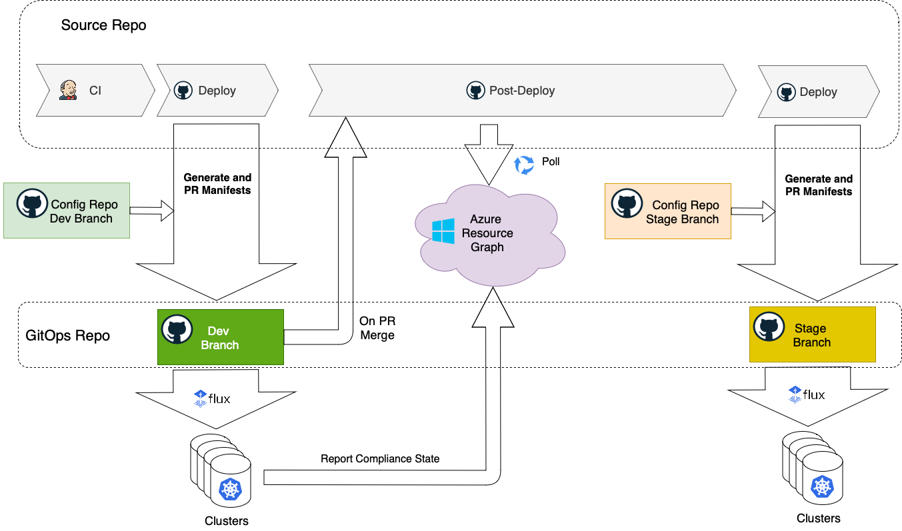

# GitOps CI/CD with GitHub

## Promotional Flow

The promotional flow is implemented with a chain of GiHub Actions Workflows:

### CI

[The `CI` workflow](../.github/workflows/templates/ci.yml)  is triggered on a commit to the *main* branch. It performs standard CI procedures, such as linting, security scanning, code analysis, unit testing, building and pushing Docker images.At the very end it invokes the CD part which starts with `Deploy` workflow.

### Deploy

[The `Deploy` workflow](../.github/workflows/templates/deploy.yml) takes the Helm manifest templates from the source repo according to the source commit id. It generates K8s manifests applying config values from the Config Git repo. It takes the config values from a branch corresponding to the current environment (e.g. `dev`). Having manifests generated, it creates a PR to the GitOps repository on the processed environment/ring branch (e.g. `dev`). The workflow updates the Git commit status specifying that the change has been promoted to the environment.

### On PR Merge

The `On PR Merge` workflow (defined in [notify-on-pr.yml](../.github/workflows/templates/notify-on-pr.yml) in GitOps repo) is triggered when the PR with the manifests is merged to the environment/ring branch in the GitOps repository. It notifies the source repository, which serves as the main orchestrator of the CD flow, by invoking the `Post Deploy` workflow.

### Post Deploy

[The `Post Deploy` workflow](../.github/workflows/templates/post-deployment.yml) checks if the deployment is successful across all clusters subscribed on this change. This workflow polls Azure Resource Graph, waiting until all registered [GitOps configurations](https://learn.microsoft.com/en-us/azure/azure-arc/kubernetes/conceptual-gitops-flux2) in the subscription are in compliance with the GitOps commit id.

If one of the clusters reports failure, the workflow fails. It updates the Git commit status in the source repository as failed and the whole promotion flow stops.

Once all configurations are compliant, the workflow updates the source commit id with `ENV Deployed` status.

The workflow checks if the change that started the CD should be promoted (e.g. originated in `main`) to the next environment and if the next environment is configured, it starts a new loop by invoking the `deploy` workflow for the next environment. The next environment name is stored in `NEXT_ENVIRONMENT` GH environment variable. The whole process stops when there is no next environment in the chain.

## Tutorial

In order to try out the promotional flow, go through the [tutorial](./tutorial/cicd-tutorial.md) that provides an end-to-end sample with the the guidance on deploying, promoting and configuring and application in GitOps fashion.

## Setup

Follow the [setup](./setup.md) instructions to bootstrap the GitOps CI/CD for your application.
