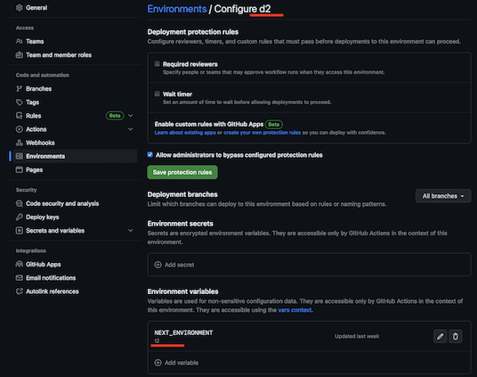

# Setup a GitOps CI/CD flow

## Have Manifest Templates

The CD flow generates K8s manifests for each environment. It needs manifests templates for that. This setup expects that the application source repository contains Helm templates for that purpose. 

It's not required to use Helm, though. You are free to go with your preferred templating approach, but in this case you'll have to update [generate-manifests.sh](../.github/workflows/templates/utils/generate-manifests.sh) utility to generate manifests in you way, instead of Helm.

The Helm chart should be put in the `/helm` folder in the source repo. Example - [Helm chart of the Hello World application](https://github.com/microsoft/kalypso-app-src/blob/main/helm/values.yaml). The chart can be created manually or with the help of [Helmify](https://github.com/arttor/helmify). For example, you have a sample of the application manifests, including deployment, service, etc. Helmify can take that sample as an input and generate a Helm chart for you, automatically identifying what parameters it should have. You can use the generated Helm chart as is, or you can manually brush it up to make it cleaner, simpler, nicer.

## Bootstrap Config and GitOps repositories

Run `setup.sh` script:

Usage: setup.sh -o <github org> -r <github application src repo> -e <first environment in chain> 

Example: setup.sh -o eedorenko -r hello-world -e dev 

The script requires the following environment variables to be set: 
 - TOKEN: GitHub personal access token with the following minimum permissions:
    Actions - R/W
    Administration - R/W
    Commit statuses - R/W
    Contents - R/W
    Metadata - RO
    Pull requests - R/W
    Secrets - R/W
    Variables - R/W
    Workflows - R/W

 OPTIONAL: 
 - AZURE_CREDENTIALS_SP: service principal azure credentials, if not set, the script will create a new service principal with contributor role on the default subscription


The script will do the following:
 - Create `gitops` repository with the name `<github org>/<github application src repo>-gitops` (e.g. `eedorenko/hello-world-gitops`). If the repo already exists, it will take it.
 - Create a branch in the `gitops` repository with the environment name (e.g. `dev`)
 - Add necessary GH actions workflows to the `gitops` repository
 - Configure necessary variables and secrets in the the `gitops` repository  
 - Create `configs` repository with the name `<github org>/<github application src repo>-configs` (e.g. `eedorenko/hello-world-configs`). If the repo already exists, it will take it.
 - Create a branch in the `configs` repository with the environment name (e.g. `dev`)
 - If the environment branch already exists in the `configs` repository and it contains any folders, the script leaves it as is. Otherwise it creates a folder `rename_me` with empty `values.yaml`.
 - Add necessary GH actions workflows to the `configs` repository
 - Configure necessary variables and secrets in the the `configs` repository     
 - Create the `source` repository if it doesn't exist. 
 - Configure necessary variables and secrets in the the `source` repository
 - Create a PR `GitOps CD setup` to the `source` repo with the necessary GH actions workflows and utility scripts

Merge the `GitOps CD setup` PR into the `source` repository.

## Define application configurations

The created `configs` repo contains application configuration values of the service for the deployment targets across environments. 
It belongs to and it is handled by the app dev team, working on the application. The nature of configs, provided here, is application centric. They determine the application behavior on various deployment targets across different environments/rings (e.g. logging level, number of replicas, feature flags, localizations, etc.). These configs are independent from the infra/platform configs. Learn more about [application and platform configs](https://learn.microsoft.com/azure/azure-arc/kubernetes/conceptual-workload-management#platform-configuration-concepts). 


### Folder structure

The folder structure in the `configs` repo is totally custom and may have any desired depth to group deployment targets in a flexible way. The correlation between a deployment target and clusters depends on the environment and app dev team preferences.

The edge cases: 
 - every deployment target represents a single cluster (e.g. `functional-testing`, `performance-testing`) - ok for low environments like `dev` or `qa` where there are a few clusters that are treated as "pets". With this approach every cluster may have unique *application* config values. 
 - single deployment target represents all thousands of clusters in the environment/ring (`early-adopters`) - ok for high environments like `prod` where all clusters are treated as a "herd" and have identical *application* config values (while having different infra/platform configs)
 

Examples:
- `early-adopters/values.yaml` - all `early-adopters` clusters have same application config values stored in the `values.yaml`
- `external-users/values.yaml`, `external-users/west/values.yaml`, `external-users/west/msu10/values.yaml` - all `external-users` clusters have same common application config values, but in addition to that, the clusters from the west region will apply/override config values specific for them. And the cluster `msu10` has very unique application config values which will be added in addition to the common and west config values.  
- `dispatcher/values.yaml`, `dispatcher/dev1/values.yaml`, `dispatcher/dev2/values.yaml` - `dev1` and `dev2` clusters have their own unique values that are applied on top of `dispatcher/values.yaml`.

The folder structure in the `configs` repo determines the folder structure in the output `GitOps` repo.

The bootstrap script creates `rename_me` folder in the `configs` repo environment branch with an empty `values.yaml` file in it. Normally, a Helm chart in the source repo contains `values.yaml` file with all possible application configurations that the Helm chart understands. Define what values you want to override at the environment/target level. For example, for the [hello-world](https://github.com/microsoft/kalypso-app-src/blob/main/helm/values.yaml) application we want to provide the following values for `functional-testing` clusters (target) in the `dev` environment. We want to rename `rename_me/values.yaml` to `functional-testing/values.yaml` and put the values in the file:

```
app:
  name: hello-world-functional
replicas: 3
```

If the `values.yaml` file in the `configs` repo remains empty, the values from the source [values.yaml](https://github.com/microsoft/kalypso-app-src/blob/main/helm/values.yaml) will be taken to generate manifests for the deployment target in this environment.  


## Add a new environment

In order to add a new environment to the application you do the following:
 1. Create branches with the environment name in the `configs` and `gitops` repos
 2. Create <Deployment_target>/values.yaml files in the environment branch in the `configs` repo with the specific application values (or just leave it empty to take default values from the source repo).
 3. Define an environment GitHub variable `NEXT_ENVIRONMENT` in the previous environment with the value of the new environment name. 
    For example, we have already configured/bootstrapped environment `d2`. Now we are creating the next environment in the chain `t2`, so the promotion flow should go like `d2`->`t2`. We need to define `NEXT_ENVIRONMENT` variable in the `d2` environment:
    
    

Steps #1 and #2 can be performed either manually (e.g. creating new `t2` branches from the `d2` branches) or by running the `setup` GitHub Actions workflow again, specifying a new environment name in the parameters.   

