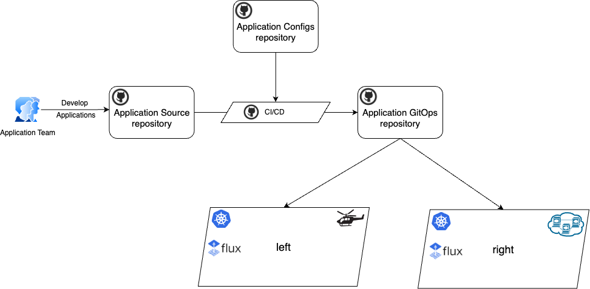
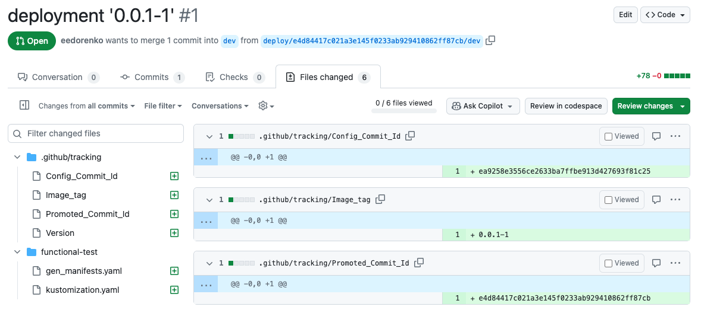
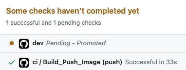
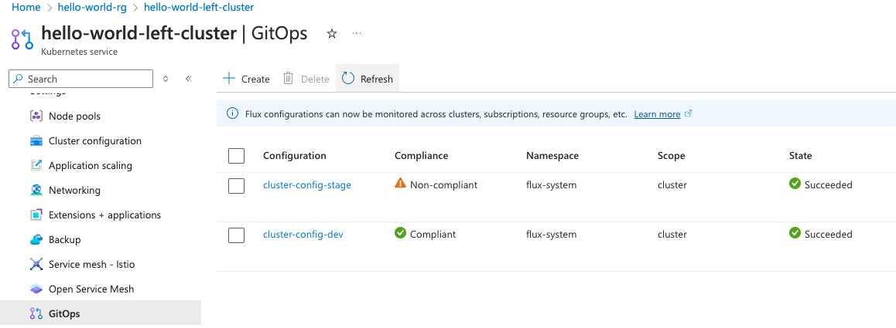
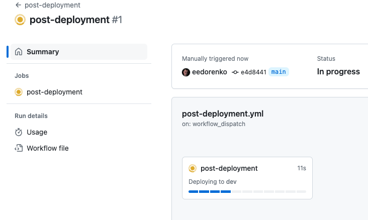
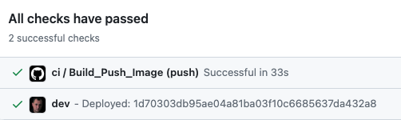
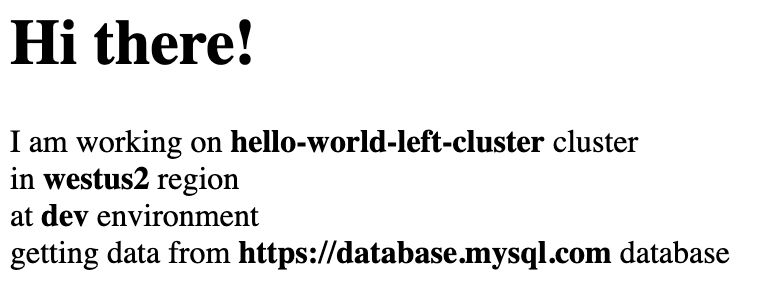
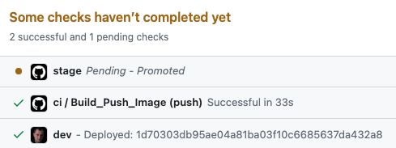
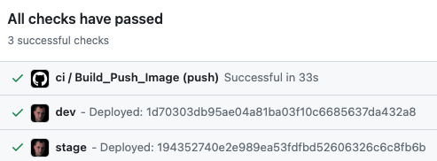
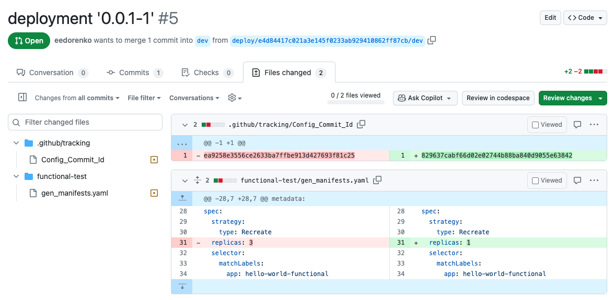

# Explore CI/CD flow with GitOps

This tutorial walks you through an example scenario of a CI/CD flow, implemented with the GitOps concept. First, you deploy a sample infrastructure with a few GitHub repositories and AKS clusters. Next, you work through a set of common use cases that reflect daily application development activities such as configuring, building and deploying an application as well as promoting a new application version to the next environment.

## Prerequisites

In order to successfully deploy the sample, you need:

- An Azure subscription. If you don't already have one, create a [free account](https://azure.microsoft.com/free/?WT.mc_id=A261C142F) before you begin.
- [Azure CLI](https://learn.microsoft.com/cli/azure/install-azure-cli)
- [GitHub CLI](https://cli.github.com)
- [kubectl](https://kubernetes.io/docs/tasks/tools/#kubectl)
- GitHub token with the following scopes:
  - Classic: `repo`, `workflow`, `write:packages`, `delete:packages`, `read:org`, `delete_repo`.
  - Fine-grained:
    - `Actions` - R/W
    - `Administration` - R/W
    - `Commit statuses` - R/W
    - `Contents` - R/W
    - `Metadata` - RO
    - `Pull requests` - R/W
    - `Secrets` - R/W
    - `Variables` - R/W
    - `Workflows` - R/W

## Deploy the sample

To deploy the sample, run the following script:

```bash
mkdir kalypso && cd kalypso
curl -fsSL -o deploy.sh https://raw.githubusercontent.com/microsoft/kalypso/main/cicd/tutorial/deploy.sh
chmod 700 deploy.sh
./deploy.sh -c -p <prefix. e.g. hello-world> -o <GitHub org. e.g. eedorenko> -t <GitHub token> -l <azure-location. e.g. westus2> 
```

This script may take 10-15 minutes to complete. After it's done, it reports the execution result in the output like this:

```output
Deployment is complete!
---------------------------------
Created repositories:
  - https://github.com/eedorenko/hello-world
  - https://github.com/eedorenko/hello-world-gitops
  - https://github.com/eedorenko/hello-world-configs
---------------------------------
Created AKS clusters in hello-world-rg resource group:
  - hello-world-left-cluster
  - hello-world-right-cluster
---------------------------------  
```

> [!NOTE]
> If something goes wrong with the deployment, you can delete the created resources with the following command:
>
> ```bash
> ./deploy.sh -d -p <preix. e.g. hello-world> -o <GitHub org. e.g. eedorenko> -t <GitHub token> -l <azure-location. e.g. westus2> 
> ```

## Sample overview

This deployment script creates an infrastructure, shown in the following diagram:



There are a few GitHub repositories:

- `Application Source` (GITHUB-ORG/PREFIX): Contains a sample application source code, including Docker files, manifest templates and CI/CD workflows.
- `Application Configs` (GITHUB-ORG/PREFIX-configs): Contains application configuration values.
- `Application GitOps` (GITHUB-ORG/PREFIX-gitops): Contains final sample application manifests to be deployed to the deployment targets.

The script creates `PREFIX-rg` resource group with two Azure Kubernetes Service (AKS) clusters: `PREFIX-left-cluster` and `PREFIX-right-cluster`.

These clusters have the `GitOps extension` installed and it uses `Flux` to reconcile manifests from the `Application GitOps` repository.

Both AKS clusters have `dev` and `stage` namespaces to represent `dev` and `stage` environments.

## Build

Right after the deployment, the `Application Source` repository automatically starts `ci` workflow. It builds a Docker image and pushes it to the GitHub packages. At the very end `ci` workflow starts `deploy` workflow, that generates Kubernetes manifests for `dev` environment and creates a PR to the `Application GitOps` repository.



Both `ci` and `cd` workflows update Git commit status in the `Application Source` repository, so it reflects the current state of the entire flow:



The application has been built and promoted to `dev` environment. The created PR with the manifests to the `dev` branch in the `Application GitOps` repository represents a fact of promotion. The application has not been deployed yet.

## Deploy

Once the PR with the manifests has been reviewed and merged, Flux controllers, running on the Kubernetes clusters, start to pull the changes and apply them to the cluster. In addition to that, Azure Arc GitOps controllers on the clusters report the state of this process up to Azure. It can be monitored for every cluster in Azure Portal on the `GitOps` tab:



The `Application Source` repository serves as a main `CI/CD` orchestrator. It starts a GitHub workflow `post-deployment` that polls Azure Resource Graph, waiting until the deployment process on all clusters is finished.



If the deployment on both clusters has finished successfully, the whole CD flow proceeds with the promotion to the next environment. If the deployment has failed, the whole process stops.

Once the deployment is finished, it is reflected in the Git commit status:



We can manually test the application on `dev` environment on both clusters. To test the application on the `left` cluster run the following command in a terminal:

```bash
kubectl port-forward svc/hello-world-functional-service -n dev 8080:8080 --context=<PREFIX>-left-cluster

# output:
# Forwarding from 127.0.0.1:8080 -> 8080
# Forwarding from [::1]:8080 -> 8080

```

While this command is running, open `localhost:8080` in your browser. You'll see the following greeting page:



Use different Kubernetes context to test the application on the `right` cluster:

```bash
kubectl port-forward svc/hello-world-functional-service -n dev 8080:8080 --context=<PREFIX>-right-cluster

# output:
# Forwarding from 127.0.0.1:8080 -> 8080
# Forwarding from [::1]:8080 -> 8080

```

## Promote

After successful deployment to `dev` environment, the `post-deployment` workflow starts `deploy` flow again to promote the application version to the `stage` environment. The `deploy` workflow takes configuration values from the `stage` branch of the `Application Configs` repository, generates Kubernetes manifests and creates a PR to the `stage` branch of the `Application GitOps` repository.

This fact is reflected in the `Application Source` repository commit status:



Once the PR with the manifests is merged, Flux starts applying the changes to the clusters. Again, the `post-deployment` workflow waits until the deployment is finished in the `stage` environment. In this sample setup there is no next environment configured after the `strage` one, so there is no any further promotion. The whole `CI/CD` flow is completed.



Use the following command to test the application on `stage` environment on the `left` cluster:

```bash
kubectl port-forward svc/hello-world-functional-service -n stage 8080:8080 --context=<PREFIX>-left-cluster
```

and on the `right` cluster:

```bash
kubectl port-forward svc/hello-world-functional-service -n stage 8080:8080 --context=<PREFIX>-right-cluster
```

## Configure

Let's reconfigure the application on the `dev` environment and decrease a number of replicas to 1.

Open a terminal and use the following script:

```bash
export org=<GitHub org>
export prefix=<prefix>

# clone the control-plane repo
git clone https://github.com/$org/$prefix-configs configs
cd configs

# create workload registration file

cat <<EOF >functional-test/values.yaml
app:
  name: hello-world-functional
replicas: 1
namespace: \$ENVIRONMENT
EOF

git add .
git commit -m 'scale down'
git push
```

This push to the `Application Configs` repository will start `deploy` workflow in the `Application Source` repository. The `deploy` workflow regenerates Kubernetes manifests for `dev` environment and creates a new PR to the `dev` branch in the `Application GitOps` repository:



Once the PR is merged, Flux reflects this change on the clusters and reduces the number of application pods in `dev` environment. This is an environment specific change, so it's not supposed to be promoted anywhere.

## Clean up resources

When no longer needed, delete the resources that you created. To do so, run the following command:

```bash
# In kalypso folder
./deploy.sh -d -p <prefix. e.g. hello-world> -o <GitHub org. e.g. eedorenko> -t <GitHub token> -l <azure-location. e.g. westus2> 
```

## Opt Out of Telemetry

To opt out of telemetry collection for tutorial usage, comment out the following line in [deploy.sh](./deploy.sh).

```bash
export AZURE_HTTP_USER_AGENT=...
```
