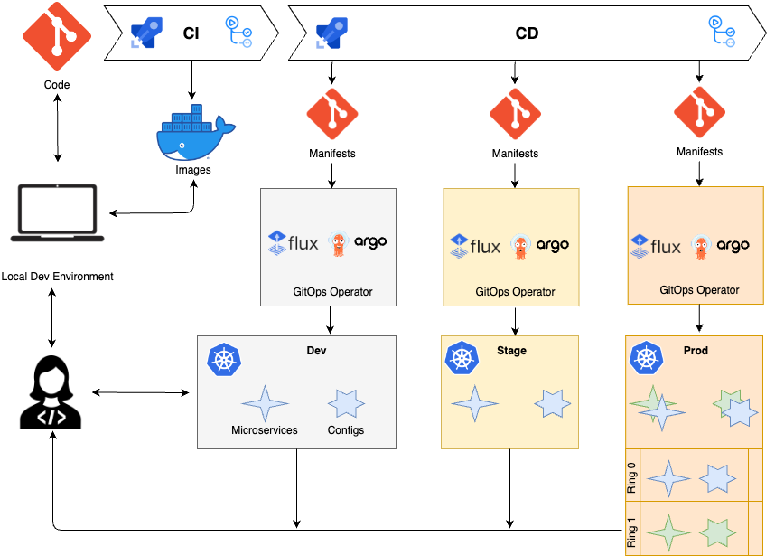
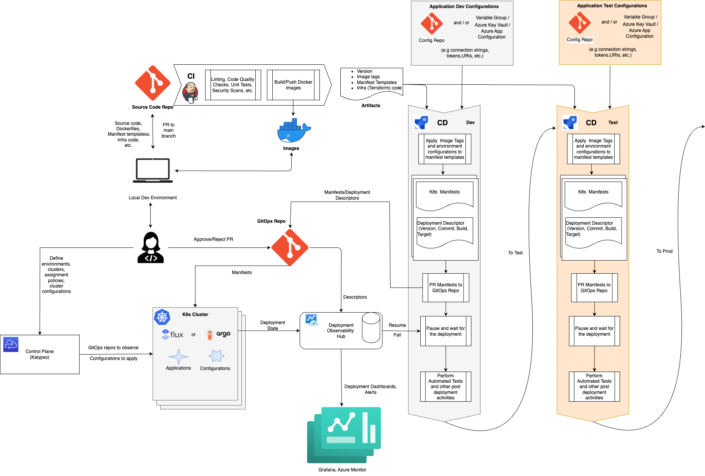

# CD process with GitOps  

This is a conceptual overview of what a CD process looks like in the GitOps paradigm.

## Overview

Application developers write their code and debug and test it both locally and on dev environment. The code is stored in the Code git repository and contains the microservice source code and descriptors describing how to build, deploy and run the microservice as a part of the whole system. Those descriptors are, normally, the Docker file and manifest templates. The Docker file is used by CI pipeline to build a Docker image. The manifest templates are used by the CD process to deploy the microservice to a chain of environments in a multistage fashion. It takes the templates from the Code repository and for each environment generates the manifests referring to the new Docker image and containing the variable values corresponding to this environment. These manifests are stored in Manifests git repository separated by branches/folders and they declaratively describe the desired state of our application in a K8s cluster in each environment. There is a GitOps operator running on a cluster that reconciles the desired cluster state by applying the manifests. When it comes to production, the deployment may be performed in a sophisticated way by implementing B/G, Canary, A/B testing deployment strategies and ring-based deployment concepts. And the whole loop is being closed by monitoring what/when/how was deployed, how it’s working, by alerts and notifications.

## Detailed Flow

On the diagram above the output of the CI pipeline is a deployable artifact which includes Docker images, Infrastructure code, K8s manifest templates and an artifact version number.

These artifacts are consumed by the CD pipeline which is triggered automatically right after the CI pipeline. The CD pipeline delivers in a multistage way K8s manifests that must be deployed for each environment and it promotes the artifacts to the next environment only after successful deployment on the previous one. For every single stage, representing an environment, the CD pipeline takes the manifest templates from the artifact, applies application configuration variables and generates K8s manifests that should be applied to the clusters in this environment.  

The configuration variables for each environment might be stored in variable groups (separated by environments), Azure Key Vaults, Azure App Configuration service or/and in order to strictly follow the GitOps doctrine they might be stored in a Configuration git repositories (separated by branches/folders for each environment). These configurations normally contain connection strings, ports, URIs, etc.

Besides K8s manifests, the CD pipeline generates a deployment descriptor for the observability purposes. The descriptor contains information about the application, dev team, version number, Build Id, etc.

The CD pipeline PRs the generated manifests and deployment descriptors to the GitOps repository which is observed by GitOps operators, such as Flux or ArgoCD. Once the PR is issued the CD pipeline is paused in agentless mode waiting for the deployment result.

When the PR is approved/merged, the Deployment Observability Hub pulls the deployment descriptor from the GitOps repository and stores the information on what application version should be deployed in this environment.

The GitOps operators on the environment clusters pull the manifests from the GitOps repo and apply them to the environment. With that done, clusters notify the Deployment Observability Hub with the deployment state, so the hub stores information about what clusters have successfully (or not) deployed the new application version. This information is used to notify the Azure CD pipeline about the overall deployment result, so it can be resumed and it can proceed to the post deployment activities, such as automated testing. If the deployment fails, the whole CD process is failed and the change will not be promoted any further.

If the deployment and post deployment activities are successful, the CD process goes to the next stage performing the very same steps on the next environment. At the very beginning of the next stage the pipeline may have a gate analyzing test results from the previous stage.

The information from the Deployment Observability Hub is consumed by the observability backends, such as Azure Monitor and/or Grafana for monitoring and alerting.

Every environment may contain different clusters for different applications and purposes. E.g. a cluster for functional testing and a cluster for performance testing. Every cluster may have different configurations and platform services. All this behavior is defined in the [Control Plane](https://learn.microsoft.com/en-us/azure/azure-arc/kubernetes/conceptual-workload-management#high-level-flow). It serves to manage environments, clusters, define rules of what applications should be deployed to what clusters in what environments, provide cluster configurations.
