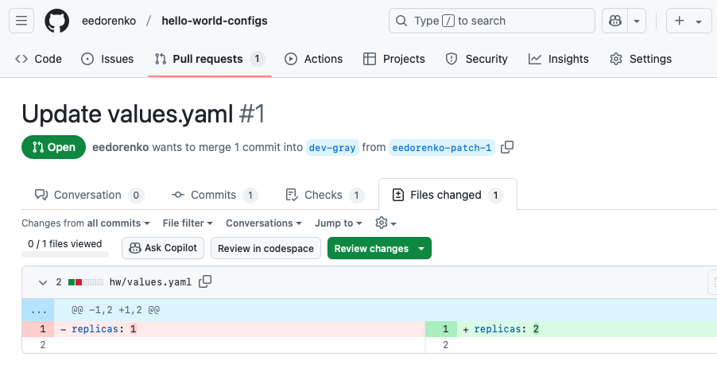
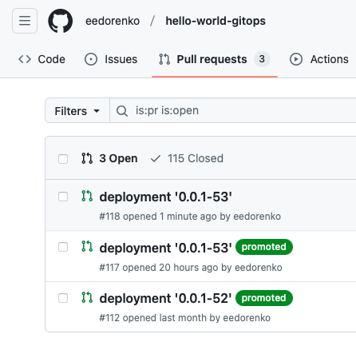
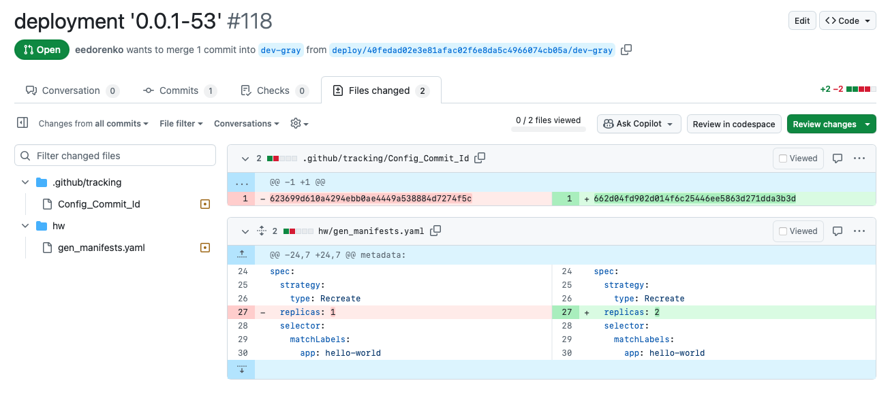
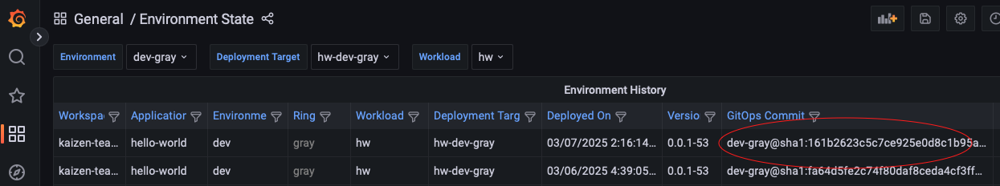
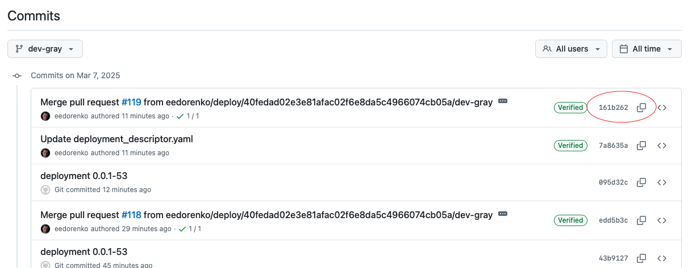

# Application Team Manages Application Configuration

- [Application Team Manages Application Configuration](#application-team-manages-application-configuration)
  - [Overview](#overview)
  - [Prerequisites](#prerequisites)
    - [1. Verify Access to Application Repositories](#1-verify-access-to-application-repositories)
  - [Steps](#steps)
    - [1. Submit Configuration Change](#1-submit-configuration-change)
    - [2. Deploy Configuration Change via GitOps](#2-deploy-configuration-change-via-gitops)
    - [3. Verify Deployment](#3-verify-deployment)
  - [Next Steps](#next-steps)
    - [Rolling Back](#rolling-back)

## Overview

This run book describes how to manage configuration at the application level.

Application configuration includes any values that do not depend on what cluster or factory the application is deployed to (ex: logging verbosity, image tags, etc.)

Configuration that does depend on what cluster or factory the application is deployed to (ex: database endpoints, KeyVault secrets, etc.) is considered platform configuration. See [Platform Team Manages Platform Configuration](./platform-team-manages-platform-configuration.md) for more information.

## Prerequisites

### 1. Verify Access to Application Repositories

Each application consists of 3 git repositories. A source repository, a configuration repository, and a GitOps repository. Identify all 3 repositories and make sure you have contributor access to all 3.

Make sure the **config repository** is cloned locally as this is the repository you will submit a change to.

## Steps
 
### 1. Submit Configuration Change

Locate the appropriate branch and values file inside the configuration repository. The branch name should identify the environment and ring that this application configuration belongs to.

Update the values file to add/remove/modify your desired configuration values. Then, create a PR the appropriate branch. Once the PR is merged, it will trigger the deployment to the matching environment.

### 2. Deploy Configuration Change via GitOps

After a change to the configuration repository has been made, a new Pull Request is automatically created against the GitOps repository.

Locate the appropriate pull request in your application's GitOps repository.

- It will be created shortly after the configuration change has been submitted.
- It will note the current version of your application.
- It should **not** be marked `promoted`.
- It will target a merge into the branch of the repository that matches the configuration branch that was updated.

Review and merge this pull request to deploy it to the target environment. If you find any issues, or otherwise wish not to deploy it, simply close the pull request without merging.

> Pull requests labeled `promoted` indicate changes that are eligible for promotion through environments.
>
> Changes to configuration are not subjects for promotion and are not labeled as such. These PRs are generated from [Application Team Promotes a Change Through Environments](./application-team-promotes-a-change-through-environments.md).
>
> 

### 3. Verify Deployment

Once the pull request has been merged, we can verify it from the deployment observability dashboards. Navigate to the Cluster State dashboard. The GitOps commit hash you see should match the GitOps commit of the PR that was merged in [step 2](#2-deploy-configuration-change-via-gitops).

 Here is a screenshot of the `hello-world` deployment history to the `dev-gray` environment. Note the latest commit hash: `sha1:161b2623...`

When we find the GitOps commit for the recently merged pull request, the commit matches: `sha1:161b2623...`. This means the correct commit has been deployed to the cluster.
  

## Next Steps

### Rolling Back

If an issue was discovered in a deployment, and it needs to be reverted, GitOps makes that easy.

1. Locate the GitOps PR for the appropriate deployment & environment.
2. Create a new GitOps PR that reverts the deployment using the "Revert" button.
3. Review and merge the resulting PR to roll back the release.

  
