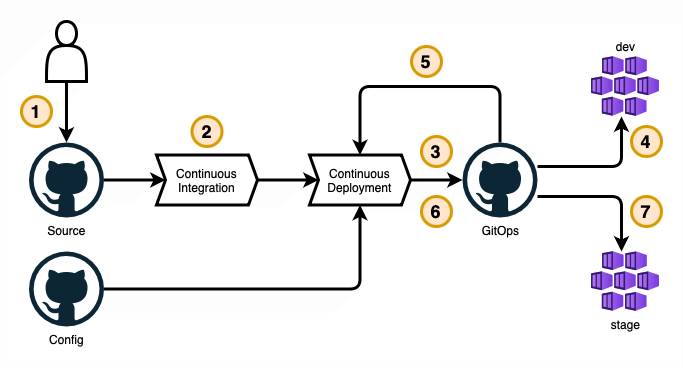

# Application Team Promotes a Change Through Environments

- [Application Team Promotes a Change Through Environments](#application-team-promotes-a-change-through-environments)
  - [Overview](#overview)
  - [Prerequisites](#prerequisites)
    - [1. Verify Access to Application Repositories](#1-verify-access-to-application-repositories)
  - [Steps](#steps)
    - [1. Update the Application Source Code](#1-update-the-application-source-code)
    - [2. Continuous Integration](#2-continuous-integration)
    - [3. Deploying to `dev`](#3-deploying-to-dev)
    - [4. Verify `dev` Deployment](#4-verify-dev-deployment)
    - [5. Promote from `dev` to `stage`](#5-promote-from-dev-to-staghe)
    - [6. Deploying to `stage`](#6-deploying-to-stage)
    - [7. Verify `stage` Deployment](#7-verify-stage-deployment)
    - [8. Repeat for Higher Environments](#8-repeat-for-higher-environments)
  - [Next Steps](#next-steps)
    - [Abandoning a Release](#abandoning-a-release)
    - [Rolling Back](#rolling-back)

## Overview

This run book describes how to submit an application change and deploy it through environments. In this run book, the example application is deployed first to a `dev` environment and then to `stage` before moving to higher environments.

This run book does not include instructions on how to manage application or platform configuration. For those details, see [Application Team Manages Application Configuration](./application-team-manages-application-configuration.md) and [Platform Team Manages Platform Configuration](./platform-team-manages-platform-configuration.md).

A high-level overview of the application promotion flow is shown below.

1. Application developer submits a change to the source repository. A pull request is created, reviewed, and merged into the `main` branch.
2. Continuous integration performs automated code quality checks, and builds artifacts required for deployment.
3. Continuous deployment generates a pull request automatically against the `dev` environment (the first environment). This pull request is merged manually.
4. The `dev` clusters see the changes and pull them to run in the cluster using GitOps.
5. Continuous deployment is triggered for the next environment once the `dev` deployment is confirmed.
6. Continuous deployment generates another pull request automatically against the next environment, `stage`. This pull request is merged manually.
7. The `stage` clusters see the changes and pull them to run in the cluster.

> For more details on the CI/CD flow, see [GitOps CI/CD with GitHub](https://github.com/microsoft/kalypso/blob/main/cicd/readme.md).

## Prerequisites

### 1. Verify Access to Application Repositories

Each application consists of 3 git repositories. A source repository, a configuration repository, and a gitops repository. Identify all 3 repositories and make sure you have contributor access to all 3.

Make sure the **source repository** is cloned locally as this is the repository you will submit a change to.

## Steps

### 1. Update the Application Source Code

First, the source code change to be promoted needs to be submitted to the source repository. This will create a new revision of the application that can be promoted across environments and rings.

The specific steps will vary for each application and change that is made. What is important is that there is a new commit to the `main` branch to trigger the whole promotion flow.

> Note: Some changes do require updating configuration such as environment variables. This run book focuses on changes to application source. For changes to configuration, you may also need to [Manage Application Configuration](./application-team-manages-application-configuration.md) or [Manage Platform Configuration](./platform-team-manages-platform-configuration.md).

### 2. Continuous Integration

This step should happen automatically when the pull request is merged to the `main` branch and will vary by application. It includes all automated checks and builds for required artifacts that will be deployed through environments (ex: building and pushing a docker image).

Watch the GitHub Actions tab of your application for the continuous integration workflow.

### 3. Deploying to `dev`

If continuous integration was successful, another GitHub Actions workflow uses the Configuration Repository to generate an automated pull request against the gitops repository. This pull request includes all updates to Kubernetes manifests that will be deployed to the first environment, `dev`.

Locate the appropriate pull request in your application's GitOps repository.

- It will be created shortly after continuous integration runs.
- It will note the latest version of your application.
- It should be marked `promoted` and the version should match.
- It will target a merge into the `dev` branch of the repository.

Review and merge this pull request to deploy it to `dev`. If you find any issues, or otherwise wish not to deploy it, simply close the pull request without merging.

> Note: Pull Requests labeled `promoted` indicate changes that are eligible for promotion through rings and environments.
>
> Changes to configuration are not subjects for promotion and are not labeled as such. These PRs are generated from [Application Team Manages Application Configuration](./application-team-manages-application-configuration.md).
>
> 

### 4. Verify `dev` Deployment

Once the GitOps PR is merged, `dev` clusters will automatically pull the changes in through Flux. Consult the deployment observability dashboards to watch for this change. You should see the version update in the dev environment.

### 5. Promote from `dev` to `stage`

If the deployment to `dev` was successful, the continuous deployment workflow will automatically trigger for the next environment, `stage`.

Look for another GitOps PR marked `promoted`. This time, it should target the `stage` environment.

### 6. Deploying to `stage`

Review and merge the GitOps PR for `stage`. This will deploy the application to `stage` clusters.

### 7. Verify `stage` Deployment

Monitor the same deployment observability dashboard to watch for this change in the `stage` environment.

### 8. Repeat for Higher Environments

This run book walks through the first 2 environments: `dev` and `stage`. However, it is likely that there are more environments eventually leading all the way to `prod`. Steps 5, 6, and 7 will repeat for each ring & environment in the promotion chain, and stop at the final environment.

Application "rings" can also be used to control application release scopes within environments. Applications each define their environments and rings independently, so the exact names may differ by application.

> For information about managing environments, see [Platform Team Creates a New Environment](./platform-team-creates-a-new-environment.md).
>
> For information about managing application rings, see [Application Team Creates a New Application Ring](./application-team-creates-a-new-application-ring.md).

## Next Steps

It is likely that an application change requires updates to configuration. Configuration changes can be either application or platform level.

- Application Level: values that do not depend on where the application is deployed (ex: logging verbosity, image tags, etc.)
- Platform Level: values that do depend on where the application is deployed (ex: database endpoints, KeyVault secrets, etc.)

To update configuration, reference the appropriate run book for the type of configuration that is being changed: [Application Team Manages Application Configuration](./application-team-manages-application-configuration.md) or [Platform Team Manages Platform Configuration](./platform-team-manages-platform-configuration.md).

### Abandoning a Release

If a promoted change needs to be abandoned, simply close and don't merge GitOps PRs. There is no need to see a release through all environments. Subsequent promotions will still function.

### Rolling Back

If an issue was discovered in a deployment, and it needs to be reverted, GitOps makes that easy.

1. Locate the GitOps PR for the appropriate deployment & environment.
2. Create a new GitOps PR that reverts the deployment using the "Revert" button.
3. Review and merge the resulting PR to roll back the release.

