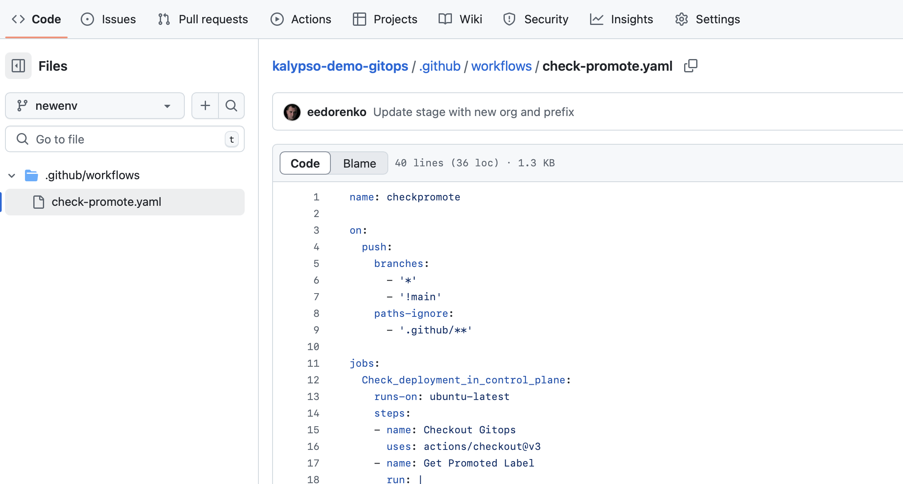
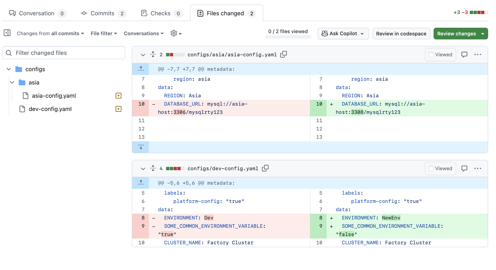
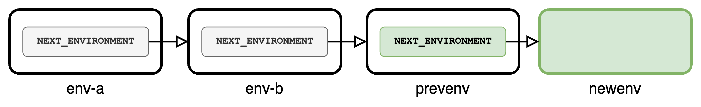
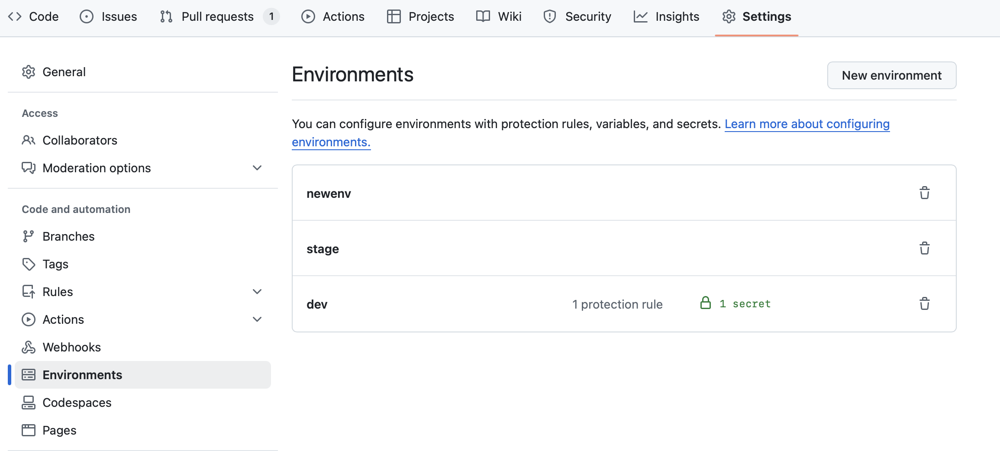
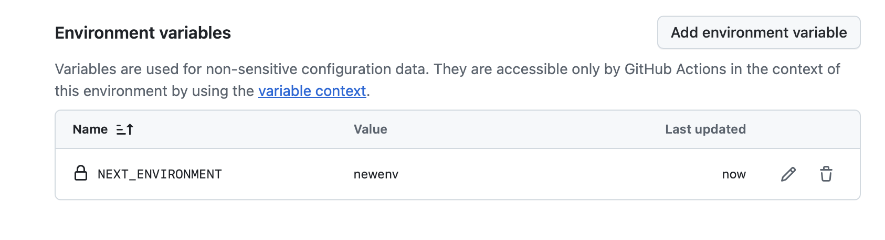
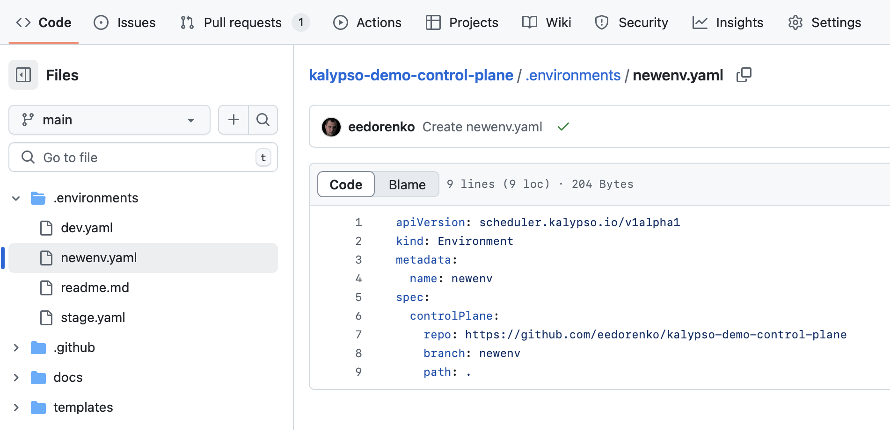

# Platform Team Creates a New Environment

- [Platform Team Creates a New Environment](#platform-team-creates-a-new-environment)
  - [Prerequisites](#prerequisites)
    - [1. Admin Access to Platform Repositories](#1-admin-access-to-platform-repositories)
  - [Steps](#steps)
    - [1. Create a GitOps Branch](#1-create-a-gitops-branch)
    - [2. Create a Control Plane Branch](#2-create-a-control-plane-branch)
    - [3. Link Environment in Promotion Sequence](#3-link-environment-in-promotion-sequence)
    - [4. Declare the Environment in the Control Plane](#4-declare-the-environment-in-the-control-plane)
  - [Next Steps](#next-steps)

## Prerequisites

This run book describes how to create a new GitOps environment at the platform level. An example promotional flow through environments might be `dev` -> `test` -> `prod` for workloads in a fleet. This runbook describes the steps necessary for creating these environments.

### 1. Admin Access to Platform Repositories

This run book is intended to be completed by a Platform Engineer with admin access to the Kalypso Control Plane and Platform GitOps repositories.

Admin access is required for modifying GitHub Environments in the control plane repository.

For reference, here are the example [Control Plane](https://github.com/microsoft/kalypso-control-plane) and [Platform GitOps](https://github.com/microsoft/kalypso-gitops) repositories from Kalypso.

Identify the following values for use in this runbook

| Variable                 | Description                                     |
| ------------------------ | ----------------------------------------------- |
| `GITOPS_REPO_URL`        | The git URL for the Platform GitOps repository. |
| `CONTROL_PLANE_REPO_URL` | The git URL for the Control Plane repository.   |

## Steps

This run book will walk through an example of creating a `newenv` environment to the end of the environments chain.

For creating other environments, replace `newenv` with your environment name.

### 1. Create a GitOps Branch

First, create a branch in the Platform GitOps repository. This repo has a branch for each environment that holds relevant GitOps manifest files.

Inside the GitOps repository, create a new git branch based off of the latest environment. In this example, that will be `prevenv`.

```sh
# switch to the existing base branch
git checkout prevenv

# create a new branch based on the existing branch
git checkout -b newenv
```

Remove the old tracking information on the new branch. These files will be automatically re-generated.

```sh
rm -rf .github/tracking
```

Remove all top-level [`ClusterType`](https://github.com/microsoft/kalypso-scheduler?tab=readme-ov-file#cluster-type) folders. The exact folders may be different based on what `ClusterTypes` were on the base branch. The appropriate folders will be re-generated for the current environment. The goal now is to create an "empty" GitOps environment branch.

```sh
# The exact set of cluster types may be different
rm -rf observability-hub/
rm -rf on-prem/
rm -rf cloud-uat/
rm -rf <other cluster type folders>
```

Finally, push this branch up to GitHub.

```sh
git add .
git commit -m "Prepare newenv environment branch"
git push -u origin newenv
```

Once complete, there should be a new branch in GitHub named `newenv`. This branch will only contain the `.github/workflows/check-promote.yaml` file and the README.md.



### 2. Create a Control Plane Branch

Next, create a branch in the Control Plane repository. This repo has a branch for each environment that holds [`ClusterTypes`](https://github.com/microsoft/kalypso-scheduler?tab=readme-ov-file#cluster-type), [`ConfigMaps`](https://github.com/microsoft/kalypso-scheduler?tab=readme-ov-file#config), and [`SchedulingPolicies`](https://github.com/microsoft/kalypso-scheduler?tab=readme-ov-file#scheduling-policy) for the environment.

Inside the Control Plane repository, create a new git branch based off the latest environment. In this runbook, that will be `prevenv`.

```sh
# switch to the existing base branch
git checkout prevenv

# create a new branch based on the existing branch
git checkout -b newenv
```

In the new branch, update `gitops-repo.yaml` to reference the GitOps branch created in [step 1](#1-create-a-gitops-branch).

```yaml
apiVersion: scheduler.kalypso.io/v1alpha1
kind: GitOpsRepo
metadata:
  name: newenv
spec:
  repo: <GITOPS_REPO_URL>
  branch: newenv
  path: .
```

It may be appropriate to update any `ClusterType`, `ConfigMap`, or `SchedulingPolicy` objects for the new environment. The exact steps here will vary depending on your use case and what clusters & applications are relevant to this environment.

> For information on updating `ClusterType` and `SchedulingPolicy` objects, see [Platform Team Schedules Applications for Deployment](./platform-team-schedules-applications-for-deployment.md).
>
> For information on updating `ConfigMap` objects, see [Platform Team Manages Platform Configuration](./platform-team-manages-platform-configuration.md).

When you are happy with the changes, push the new branch to GitHub.

```sh
git add .
git commit -m "Prepare newenv environment"
git push -u origin newenv
```

In our example `newenv` environment, we updated a few `ConfigMap` objects, but did not change any `SchedulingPolicy` or `ClusterType` objects.



### 3. Link Environment in Promotion Sequence

Now that our git branches for the new `newenv` environment are set up, we need to declare where this environment lives in the promotion sequence. This is defined using GitHub environments inside the Control Plane repository.

Each Environment optionally contains a variable called `NEXT_ENVIRONMENT` that points to the next environment in the sequence. This creates a linked list that dictates how Control Plane changes are promoted through environments.

We will update `prevenv` to include a new `NEXT_ENVIRONMENT` variable that points to the new `newenv` environment.



First, create a new Environment called `newenv`.



Update the previous environment, `prevenv`, to point to the new `NEXT_ENVIRONMENT`, `newenv`.



### 4. Declare the Environment in the Control Plane

Now, we can declare the environment in the Control Plane for Kalypso to reference.

On the `main` branch of the Control Plane, create an [`Environment`](https://github.com/microsoft/kalypso-scheduler?tab=readme-ov-file#environment) object inside the `.environments/` folder.

```yaml
# newenv.yaml
apiVersion: scheduler.kalypso.io/v1alpha1
kind: Environment
metadata:
  name: newenv
spec:
  controlPlane:
    repo: <CONTROL_PLANE_REPO_URL>
    branch: newenv
    path: .
```



## Next Steps

The new environment likely does not have any GitOps manifests inside it. To create these, we will need to declare what applications should be deployed into this environment. To do this, follow [Platform Team Schedules Applications for Deployment](./platform-team-schedules-applications-for-deployment.md).

It is also likely that applications deployed into this new environment will need changes to their configurations. This will vary by application, but can be achieved through [Application Team Manages Application Configuration](./application-team-manages-application-configuration.md) and [Platform Team Manages Platform Configuration](./platform-team-manages-platform-configuration.md).

It may also make sense to set up deployment rings for applications in this new environment. See [Application Team Creates a New Application Ring](./application-team-creates-a-new-application-ring.md) for more information.

Applications can now be deployed through this environment through the standard promotion flow described in [Application Team Promotes a Change Through Environments](./application-team-promotes-a-change-through-environments.md).
