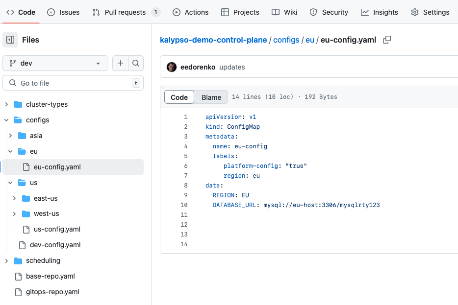
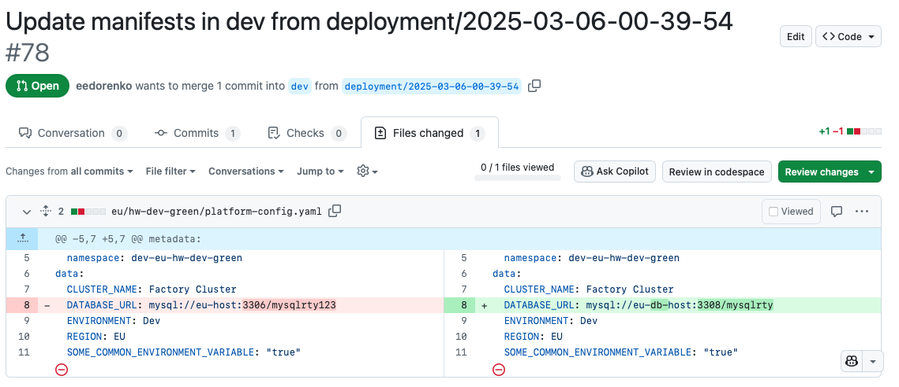

# Platform Team Manages Platform Configuration

- [Platform Team Manages Platform Configuration](#platform-team-manages-platform-configuration)
  - [Overview](#overview)
  - [Prerequisites](#prerequisites)
    - [1. Access to Platform Control Plane and GitOps Repos](#1-access-to-platform-control-plane-and-gitops-repos)
  - [Steps](#steps)
    - [1. Create/Update ConfigMaps](#1-createupdate-configmaps)
    - [2. Review and Merge GitOps Pull Request](#2-review-and-merge-gitops-pull-request)
  - [Next Steps](#next-steps)

## Overview

Platform configuration is any value that is specific to an environment and cluster. For example, a database endpoint will be different for the same application deployed in 2 different factories or 2 different environments.

In Kalypso, Platform configuration is managed through the Kalypso Control Plane repository. Review the root [README.md in the example Kalypso Control Plane repository](https://github.com/microsoft/kalypso-control-plane) for details on how CI/CD works for platform configuration using the promotional flow.

> Any value that does not depend on environment or cluster should instead be managed through [Application Team Manages Application Configuration](./application-team-manages-application-configuration.md). These values are specific to the application or deployment ring, not tied to the hosting platform.

## Prerequisites

### 1. Access to Platform Control Plane and GitOps Repos

This run book is intended to be completed by the Platform Engineer with contributor access to the Kalypso Control Plane and Platform GitOps repositories.

For reference, here are the example [Control Plane](https://github.com/microsoft/kalypso-control-plane) and [Platform GitOps](https://github.com/microsoft/kalypso-gitops) repositories from Kalypso.

## Steps

### 1. Create/Update ConfigMaps

Find or create the relevant ConfigMap in the correct branch & folder in the Platform Control Plane repository. Configs are provided to applications based on templating and label matching.

| Variable        | Description                                                                   |
| --------------- | ----------------------------------------------------------------------------- |
| `NAME`          | an identifier for the config map                                              |
| `CLUSTER_TYPE`  | (Optional) specify specific cluster types that the config map should apply to |
| `WORKLOAD_NAME` | (Optional) specify specific workloads that the config map should apply to     |

Additional labels for custom label matching can be provided as necessary.

```yaml
apiVersion: v1
kind: ConfigMap
metadata:
  name: <NAME>
  labels:
    platform-config: "true"

    # Optional labels
    # cluster-type: <CLUSTER_TYPE>
    # workload: <WORKLOAD_NAME>

    # Add any other custom labels as desired

data:
  # Whatever values you'd like. Keys and values must be strings.
  exampleConfigKey: exampleConfigValue
```

The following example demonstrates a ConfigMap with platform configurations for all clusters in the EU region. This is determined by `region: eu` label.



All configurations that apply to every cluster will be consolidated int final platform-config ConfigMaps in the Platform GitOps repository.

### 2. Review and Merge GitOps Pull Request

Once the configuration values have been updated in the platform control plane repositry on the appropriate git branch, an automated pull request will be created against the Platform GitOps repository.

Check the Platform GitOps repository for these pull requests. Review the changes and merge when ready to deploy.



## Next Steps

To troubleshoot deployments, see the Kalypso Observability Hub dashboards that provide an overview of what applications are deployed into what clusters.

It may be necessary to work with the specific application development teams to troubleshoot broken deployments.
