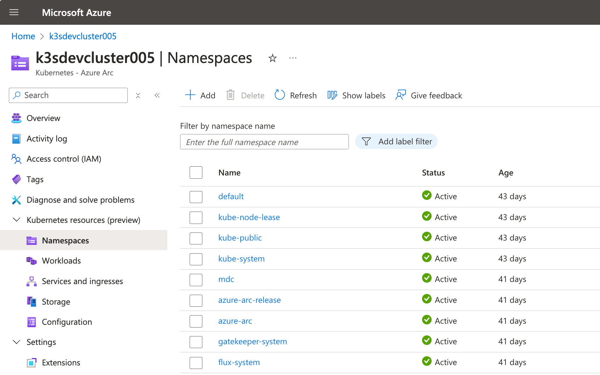
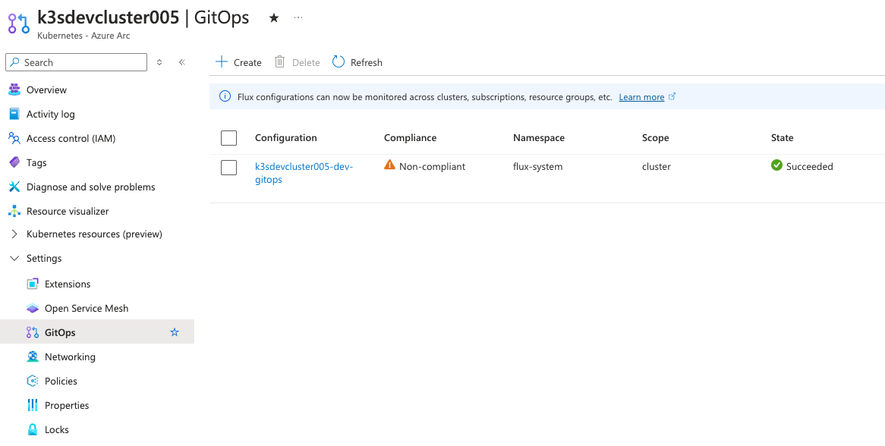

# Platform Team Onboards a New Cluster

- [Platform Team Onboards a New Cluster](#platform-team-onboards-a-new-cluster)
  - [Prerequisites](#prerequisites)
    - [1. Provision a Kubernetes Cluster](#1-provision-a-kubernetes-cluster)
    - [2. Gather GitOps Details](#2-gather-gitops-details)
  - [Steps](#steps)
    - [1. Install and Configure a GitOps Agent](#1-install-and-configure-a-gitops-agent)
    - [2. (Optional) Install other Components](#2-optional-install-other-components)
  - [Next Steps](#next-steps)

## Prerequisites

### 1. Provision a Kubernetes Cluster

This run book assumes access to an existing Kubernetes cluster. This could be a managed AKS cluster in Azure, or an Arc-Enabled connected Kubernetes cluster.

- For a managed AKS cluster, see [Quickstart: Deploy an Azure Kubernetes Service (AKS) cluster using Azure portal](https://learn.microsoft.com/en-us/azure/aks/learn/quick-kubernetes-deploy-portal)
- For an Arc-Enabled connected Kubernetes cluster, see [Quickstart: Connect an existing Kubernetes cluster to Azure Arc](https://learn.microsoft.com/en-us/azure/azure-arc/kubernetes/quickstart-connect-cluster?tabs=azure-cli)

Once the cluster is provisioned, locate and verify access to the cluster resource in the Azure portal. Verify your Entra ID access to ARM and Kubernetes resources by viewing Kubernetes resources (namespaces, workloads, etc.)



Collect the following values for use in this runbook.

| Variable              | Description                                                                                                          |
| --------------------- | -------------------------------------------------------------------------------------------------------------------- |
| `RESOURCE_GROUP_NAME` | The name of the resource group that the Kubernetes cluster is in                                                    |
| `SUBSCRIPTION`        | The name of the subscription that the Kubernetes cluster is in                                                      |
| `CLUSTER_NAME`        | The name of the Kubernetes cluster resource                                                                         |
| `NAMESPACE`           | The Kubernetes namespace to deploy GitOps configuration into                                                        |
| `CLUSTER_TYPE`        | `connectedClusters` if this is an Arc-connected cluster, `managedClusters` if this is an AKS cluster hosted in Azure |

### 2. Gather GitOps Details

Identify the Platform GitOps repository details for this cluster.

This run book assumes an existing Platform GitOps repository is set up. Gather the following details for this cluster as they will be used when configuring the GitOps agent on the cluster. These 3 variables together reference a location in git for the GitOps agent to monitor.

| Varaible        | Description                                                            |
| --------------- | ---------------------------------------------------------------------- |
| `GITOPS_REPO`   | The git repository URL for the Platform GitOps repo                    |
| `GITOPS_BRANCH` | The git branch in the Platform GitOps repo                             |
| `GITOPS_PATH`   | The file path to monitor on the git branch of the Platform GitOps repo |

## Steps

### 1. Install and Configure a GitOps Agent

In order for a cluster to host workload deployments managed by Kalypso, it will need a GitOps agent. These runbooks will use the [Flux v2 AKS extension](https://learn.microsoft.com/en-us/azure/azure-arc/kubernetes/conceptual-gitops-flux2) as the GitOps agent. This will ensure support for the [Kalypso Obserability Hub](https://github.com/microsoft/kalypso-observability-hub).

To use another GitOps agent (like [ArgoCD](https://argo-cd.readthedocs.io/en/stable/)), work with the Platform team to ensure that proper [Reconciler templates](https://github.com/microsoft/kalypso-scheduler?tab=readme-ov-file#reconciler-template) are set up.

Have a GitHub token with the readonly permissions to the Platform GitOps and application GitOps repositories. This token will be used by Flux to pull manifests to the clusters.

Run the following Azure CLI command to create the Flux configuration on this cluster. Reference the variables gathered from Prerequisites.

```sh
kubectl create secret generic repo-secret \
    --from-literal=username=kalypso \
    --from-literal=password=<GITHUB TOKEN> \
    -n flux-system

az k8s-configuration flux create \
    --resource-group <RESOURCE_GROUP_NAME> \
    --cluster-name <CLUSTER_NAME> \
    --name <CLUSTER_NAME>-<ENVIRONMENT>-gitops \
    --namespace flux-system \
    --cluster-type <CLUSTER_TYPE> \
    --local-auth-ref repo-secret \
    --scope cluster \
    --url <GITOPS_REPO> \
    --branch <GITOPS_BRANCH> \
    --kustomization name=platform path=<GITOPS_PATH> prune=true \
    --subscription <SUBSCRIPTION>
```

See [Tutorial: Deploy applications using GitOps with Flux v2](https://learn.microsoft.com/en-us/azure/azure-arc/kubernetes/tutorial-use-gitops-flux2?tabs=azure-cli) for instructions on getting started with GitOps and Flux v2.



### 2. (Optional) Install other Components

This would be a good time to install and configure other platform level components for clusters in the fleet.

For Kalypso, only the GitOps agent is required, but other standardized components for the fleet might include:

- Kubernetes operators
- Secret management components
- Observability components

## Next Steps

Once all steps have been completed, the cluster is ready to host applications. If the platform GitOps configuration provided in step 1 already existed, the cluster may already be pulling and running applications scheduled for the appropriate environment.

Otherwise, see [Schedule Applications for Deployment onto Clusters](./platform-team-schedules-applications-for-deployment.md) for instructions on how to deploy specific applications to the new cluster.
