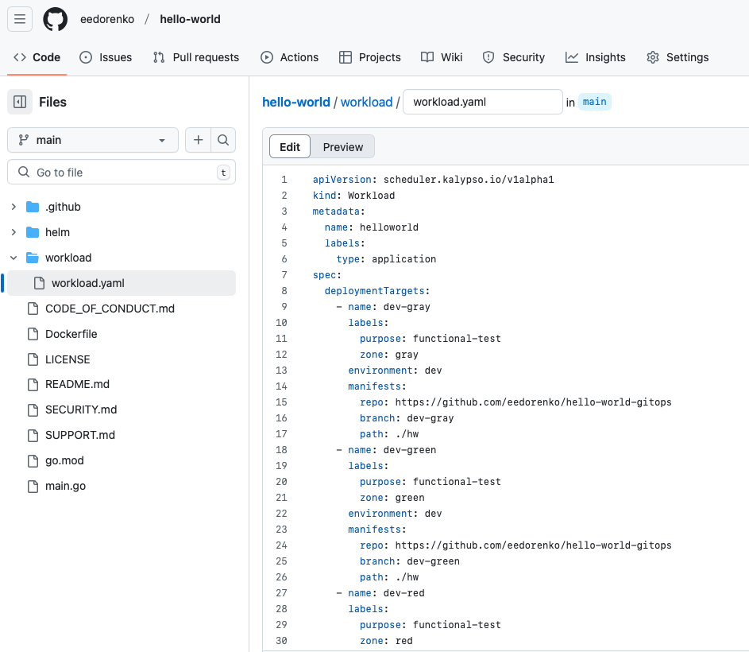
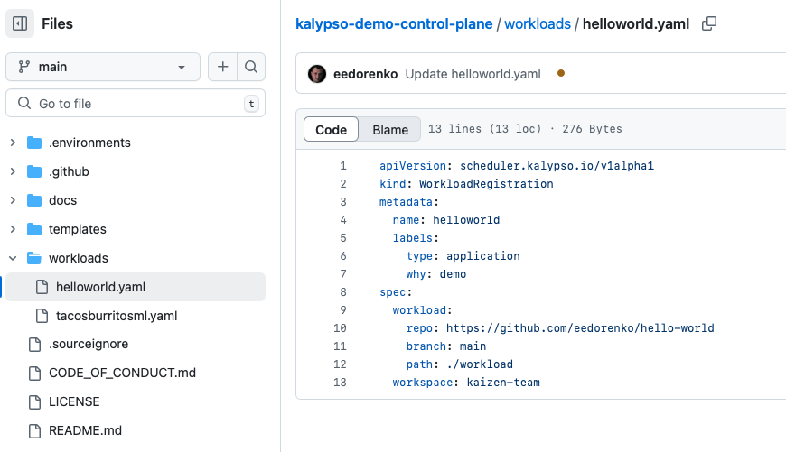
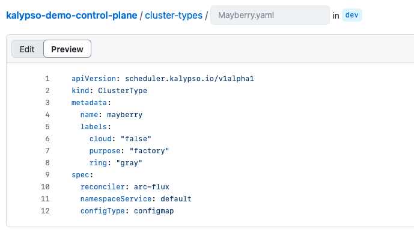
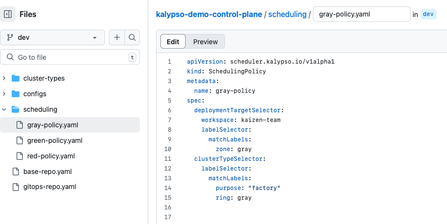

# Platform Team Schedules Applications for Deployment

- [Platform Team Schedules Applications for Deployment](#platform-team-schedules-applications-for-deployment)
  - [Prerequisites](#prerequisites)
    - [1. Access to Platform Control Plane and GitOps Repos](#1-access-to-platform-control-plane-and-gitops-repos)
    - [2. Identify a Cluster in the Fleet](#2-identify-a-cluster-in-the-fleet)
    - [3. Identify an Application](#3-identify-an-application)
  - [Steps](#steps)
    - [1. Create or Find a `WorkloadRegistration`](#1-create-or-find-a-workloadregistration)
    - [2. Create or Find a `ClusterType`](#2-create-or-find-a-clustertype)
    - [3. Schedule an Application for Deployment onto a Cluster](#3-schedule-an-application-for-deployment-onto-a-cluster)
    - [4. Merge GitOps PRs](#4-merge-gitops-prs)
  - [Next Steps](#next-steps)

## Prerequisites

### 1. Access to Platform Control Plane and GitOps Repos

This run book is intended to be completed by the Platform Engineer with contributor access to the Kalypso Control Plane and Platform GitOps repositories.

For reference, here are the example [Control Plane](https://github.com/microsoft/kalypso-control-plane) and [Platform GitOps](https://github.com/microsoft/kalypso-gitops) repositories from Kalypso.

### 2. Identify a Cluster in the Fleet

The clusters compose the fleet, and the applications are the workloads that will be scheduled to run on the fleet. For instructions on onboarding a cluster, see [Platform Team Onboards a New Cluster](./platform-team-onboards-a-new-cluster.md).

**It is not strictly required to have a cluster provisioned before scheduling applications onto it.** If the cluster is not onboarded to the fleet, this run book will create the GitOps manifests in GitHub, but there will be no flux reconcilers watching these manifests, so they will not be deployed.

Collect the following values for use later in this run book.

| Variable            | Description                                                                         |
| ------------------- | ----------------------------------------------------------------------------------- |
| `CLUSTER_TYPE_NAME` | The logical name of the cluster (e.g. `Mayberry`) or a group of identical clusters |

### 3. Identify an Application

Finally, identify an existing application to schedule for deployment onto the fleet. Before starting this run book, make sure the application is onboarded by following [Application Team Onboards a New Application](./application-team-onboards-a-new-application.md).

Identify the location of the [Workload](https://github.com/microsoft/kalypso-scheduler?tab=readme-ov-file#workload-registration) declaration file for the application.

Collect the following values for use later in this run book.

| Variable              | Description                                                             |
| --------------------- | ----------------------------------------------------------------------- |
| `WORKLOAD_GIT_URL`    | URL of application git repository holding the Workload registration     |
| `WORKLOAD_GIT_BRANCH` | git branch holding the Workload registration                            |
| `WORKLOAD_GIT_PATH`   | file path of the Workload registration                                  |
| `APPLICATION_NAME`    | the application name inside the workload yaml file                      |
| `KALYPSO_WORKSPACE`   | this is a custom label for grouping workloads within the Kalypso system |



## Steps

### 1. Create or Find a `WorkloadRegistration`

This only needs to be done once per application. If this is the first time your application has been scheduled for a GitOps deployment, it will need to be registered with the Control Plane. Otherwise, this should already be done for your application.

Submit a [`WorkloadRegistration`](https://github.com/microsoft/kalypso-scheduler?tab=readme-ov-file#workload-registration) object on the `main` branch of the Control Plane repository inside the workloads folder.

```yaml
apiVersion: scheduler.kalypso.io/v1alpha1
kind: WorkloadRegistration
metadata:
  name: <APPLICATION_NAME>
  labels:
    type: application
spec:
  workload:
    repo: <WORKLOAD_GIT_URL>
    branch: <WORKLOAD_GIT_BRANCH>
    path: <WORKLOAD_GIT_PATH>
  workspace: <KALYPSO_WORKSPACE>
```



### 2. Create or Find a `ClusterType`

This needs to be done for each environment and cluster type that can host applications. If your cluster and environment already hosts applications, this should be done already.

Otherwise, you will need to submit a [`ClusterType`](https://github.com/microsoft/kalypso-scheduler?tab=readme-ov-file#cluster-type) to the branch for your cluster inside the `cluster-types/` folder.

```yaml
apiVersion: scheduler.kalypso.io/v1alpha1
kind: ClusterType
metadata:
  name: <CLUSTER_TYPE_NAME>
  labels:
    # These are example labels, you can modify as necessary.
    # Labels are free-form and will be used with label-matching to later determine what applications should run on this `ClusterType`.
    cloud: "false"
    purpose: "factory"
    ring: "gray"
spec:
  reconciler: arc-flux
  namespaceService: default
  configType: configmap
```



### 3. Schedule an Application for Deployment onto a Cluster

Finally, we need to define a mapping between applications and clusters. This is done by label matching `deploymentTargets` and [`ClusterTypes`](https://github.com/microsoft/kalypso-scheduler?tab=readme-ov-file#cluster-type) in a [`SchedulingPolicy`](https://github.com/microsoft/kalypso-scheduler?tab=readme-ov-file#scheduling-policy) object.

Create a `SchedulingPolicy` in the `scheduling/` folder of the environment branch.

> Deployment target labels are defined by the application team in their `workload.yaml` file. This was set up when the application was onboarded with [Application Team Onboards a New Application](./application-team-onboards-a-new-application.md).
>
> The cluster type labels were defined in [step 2](#2-create-or-find-a-clustertype) of this run book.

```yaml
apiVersion: scheduler.kalypso.io/v1alpha1
kind: SchedulingPolicy
metadata:
  # Feel free to use any name you want
  name: example-scheduling-policy
spec:
  deploymentTargetSelector:
    workspace: <KALYPSO_WORKSPACE>
    labelSelector:
      matchLabels:
        # modify these labels to match the desired deployment targets
        zone: gray
  clusterTypeSelector:
    labelSelector:
      matchLabels:
        # modify these labels to match the desired cluster type
        purpose: "factory"
        ring: gray
```

> Note: there is no mention of the specific workload or cluster host in this object, but it is the link that makes specific workloads get deployed onto specific clusters because of how applications and clusters are independently labeled.



### 4. Merge GitOps PRs

Until now, only our application workload scheduling desire has been declared in the Control Plane repository. Nothing has actually been deployed yet. The previous actions will create pull requests automatically in the Platform GitOps repository as appropriate.

The GitOps pattern uses these final pull requests as a manual approval for actually deploying applications to clusters.

Navigate to the Platform GitOps Pull Requests view to see any automated PRs that were created. Once these PRs are merged, clusters watching the GitOps repository will automatically pull and install the updates.

Your specific pull requests will look different based on what applications are scheduled onto which clusters.

## Next Steps

The [Kalypso Observability Hub](https://github.com/microsoft/kalypso-observability-hub?tab=readme-ov-file#deployment-reports) dashboards provide an overview of what applications are deployed into which clusters.

If there are any issues with scheduled deployments, work with the application experts to troubleshoot. There may be issues with configuration.

- To fix platform configuration issues, see [Platform Team Manages Platform Configuration](./platform-team-manages-platform-configuration.md).
- To fix application configuration issues, see [Application Team Manages Application Configuration](./application-team-manages-application-configuration.md).
